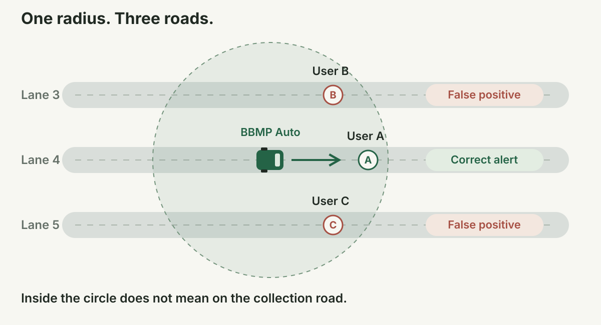
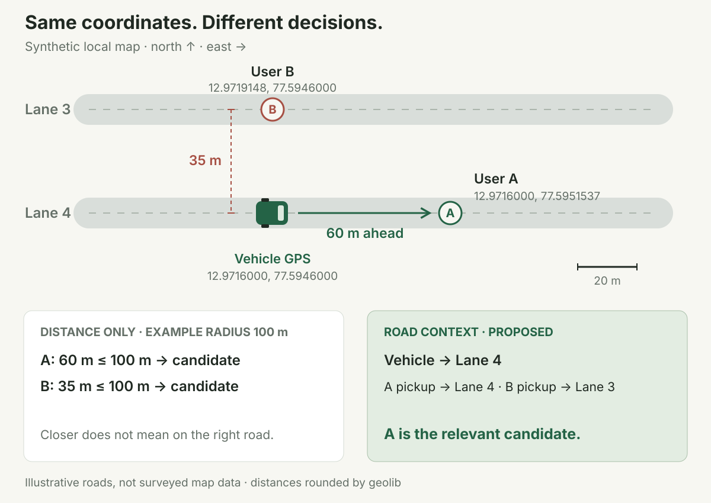
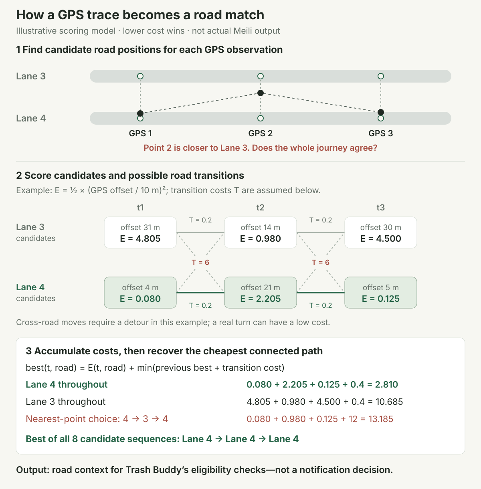
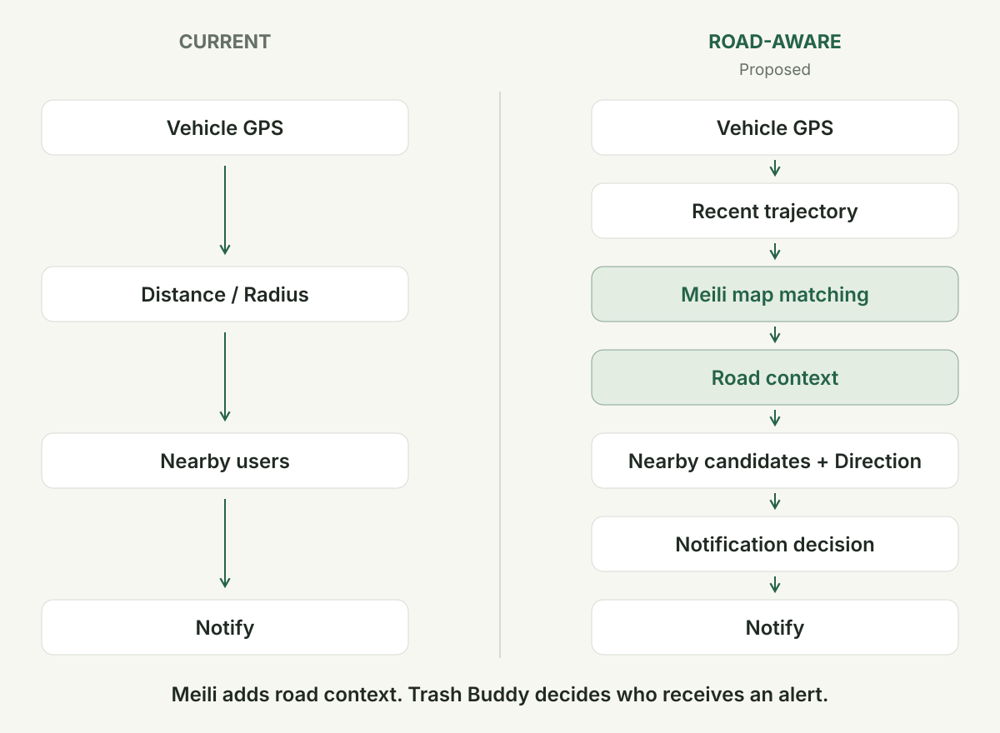

# When Distance Isn’t Enough: Exploring Road-Aware Alerts in Trash Buddy

## Introduction

Trash Buddy helps residents know when a BBMP waste collection vehicle is nearby. The vehicle shares its GPS position, and the backend checks whether residents are close enough to receive an alert.

Dense neighbourhoods expose a gap between what a coordinate tells us and what a resident needs to know.

**Trash Buddy doesn’t just need to know whether the waste collection vehicle is close to you. It needs to understand whether the vehicle is actually coming to you.**

## The Problem With “Nearby”

Imagine three parallel streets. User B lives on Lane 3, User A on Lane 4, and User C on Lane 5. The collection auto is travelling along Lane 4 toward User A.

A proximity circle around the auto can cover all three residents. Users B and C might receive an alert even though the vehicle is collecting on another road.



The calculation answers an incomplete question.

**Geographically close ≠ operationally relevant.**

In the active backend, GPS updates reach an Express endpoint and pass through `DriverService`. A `geolib` distance check finds nearby residents, then `NotificationService` applies preferences and cooldowns before sending through Firebase or Twilio. Heading is stored, but it does not currently affect notification eligibility.

## Why Reducing the Radius Doesn’t Work

Suppose User A is 60 metres ahead on the same road, while User B is only 35 metres away on a neighbouring road. Here is a worked example using synthetic points near Bengaluru—not surveyed pickup locations.

Shrinking the radius to 40 metres excludes A while keeping B. We have made the circle smaller without making the decision better.

GPS also drifts. Homes sit back from the street. Apartment markers may point to a building’s centre instead of its entrance. A tight threshold can cause genuine users to miss alerts.

The phone reports the position; the backend calculates the separation. An example `POST /api/location/update` payload is:

```json
{
  "driverId": "rider-1",
  "latitude": 12.9716000,
  "longitude": 77.5946000,
  "heading": 90,
  "timestamp": "2026-10-07T04:30:00Z"
}
```

The driver ID must be configured. Heading 90° means east; it does not change today’s eligibility check.

Our installed `geolib.getDistance()` uses the spherical law of cosines:

```text
d = R × acos(sin φ₁ sin φ₂ + cos φ₁ cos φ₂ cos(λ₂ − λ₁))
R = 6,378,137 metres; φ = latitude, λ = longitude, in radians
```

Convert degrees with `radians = degrees × π / 180`. Substituting the vehicle coordinate and each saved point gives:

```text
A: (12.9716000, 77.5951537) → 60.065 m → rounded: 60 m
B: (12.9719148, 77.5946000) → 35.043 m → rounded: 35 m

Example radius = 100 m
A: 60 ≤ 100 → candidate
B: 35 ≤ 100 → candidate
```

These results were checked with the repository’s installed library. The radius is illustrative. Metre rounding is computational precision, not a promise of metre-accurate GPS.



Distance remains useful for finding candidates. It needs road context before it can support a more reliable notification decision.

## Adding Road Context With Valhalla + Meili

We are exploring [Valhalla’s Meili map-matching engine](https://valhalla.github.io/valhalla/contributing/architecture/meili/algorithms/) to supply that context.

GPS gives us an approximate vehicle position. Map matching can help identify which road the vehicle is following. Trash Buddy must then decide whether a particular resident should receive an alert.

Rather than snapping each point to the nearest road independently, Meili considers a sequence of observations and plausible movement through the road network. A brief GPS jump toward Lane 3 could still fit a consistent journey along Lane 4.

The visual below opens up that process: score each candidate’s GPS offset, add the cost of moving between road positions, and keep the cheapest sequence. Its simplified numbers illustrate the idea; they are not Meili’s exact scoring or measured results.



That is useful evidence, not certainty. Two close parallel roads may remain ambiguous. Missing roads or poor GPS can produce an incorrect match. We have not implemented or validated this integration yet.

## How Trash Buddy Could Use It

We propose keeping a short recent trajectory for each vehicle and processing it asynchronously. A matching result could then inform the notification decision without making the GPS endpoint wait for the entire process.



We would check nearby candidates for road relevance, approach direction, preferences and duplicates. In the illustrated example, A’s pickup shares Lane 4 with the vehicle; B’s does not. That road association is proposed input, not something the distance formula establishes.

A home marker may face a back street while collection happens at another gate. We propose a separately confirmed pickup point and road association.

Recent road progress could establish direction; a stopped collection vehicle needs different handling from one that has passed.

Meili would provide context; Trash Buddy would own the final decision.

## What We Need to Test

We want to test recorded journeys through parallel roads, intersections, service lanes and apartment entrances, including stops, U-turns and GPS gaps.

Intersections are particularly revealing: knowing the road a vehicle has followed does not tell us which turn it will take next. Waiting for entry into a lane may reduce false alerts, but it also reduces warning time.

We propose running the new logic in shadow mode first: record its decisions without sending additional notifications, then compare both approaches against labelled collection opportunities.

We would measure correct alerts, false positives, missed opportunities and notification lead time. Replays must use only the observations available at each moment.

And even the correct road cannot prove that a driver will stop at every pickup. That may require collection-status or route information beyond GPS.

## Closing

Distance tells us that a vehicle is nearby. Road context may tell us whether it is actually coming to you. That’s the hypothesis we’ll be testing next.

*Open source & attribution: Valhalla / Meili is [MIT licensed](https://github.com/valhalla/valhalla/blob/master/COPYING). Proposed road-network data may use [© OpenStreetMap contributors, under ODbL](https://www.openstreetmap.org/copyright). These diagrams are conceptual illustrations.*
